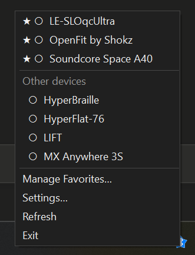
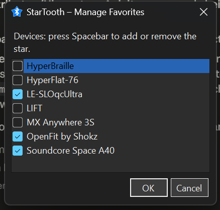
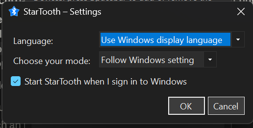

# StarTooth


A Windows tray tool that lists every paired Bluetooth device and connects or disconnects it with
a click. Devices can be starred; favourites then sit at the top of the list, with everything else
grouped below under "Other devices".

<br clear="left">



## Download

Grab the latest build from the [Releases](https://github.com/slohmaier/StarTooth/releases) page. Two
forms, both self-contained — no .NET runtime to install:

- **Installer** (`StarTooth-Setup-<version>.exe`) — Start Menu entry, optional desktop icon,
  clean uninstall via Programs & Features.
- **Portable** (`StarTooth.exe`) — a single file, just run it. Nothing is written outside
  `%APPDATA%\StarTooth` (settings and favourites) and, if you enable autostart, the registry Run
  key.

Requires 64-bit Windows 10 build 19041 or newer. Both files are Authenticode-signed; the signing
certificate is a personal development cert, so Windows SmartScreen may still show a warning on
machines that do not trust it — choose "More info → Run anyway".

## Usage

| Action | Effect |
| --- | --- |
| Left- or right-click the tray icon | Open the device list |
| Click or press Enter on a device | Connect or disconnect it |
| "Manage Favorites…" | Dialog for starring devices |
| "Settings…" | Language, colour mode, autostart |

Every entry carries an indicator for its state:

| Indicator | Meaning |
| --- | --- |
| `●` | Connected (also bold) |
| `○` | Not connected |
| `◌` | A connection attempt is running |
| `★` | Favourite |

As long as no device is starred, the list stays flat and ungrouped.

A connection attempt, its result and any failure are also reported as a Windows notification. This
is necessary because activating an entry closes the menu, so the menu itself cannot show the
progress.

### Accessibility

The menu needs no mouse gestures and no modifier keys: stars are not assigned in the menu itself
but in a separate dialog built on a standard `CheckedListBox`, where the space bar toggles them
and the screen reader announces the state on its own.



Bold text and the symbols `● ○ ◌ ★` are purely visual. Screen readers speak such symbols
inconsistently — whether a glyph is spoken at all depends on the configured symbol verbosity — so
none of them is the sole carrier of its state: every entry also spells it out in `AccessibleName`
("Shokz OpenFit, favourite, connected") and describes the effect of activating it in
`AccessibleDescription`.

Running connection attempts stay deliberately activatable rather than being set to
`Enabled = false`: ToolStrip skips disabled items during keyboard navigation, which would make the
running attempt the one state a keyboard or screen reader user could never reach. A second
activation is refused by the caller instead.

The "Other devices" heading is a disabled entry and therefore not reachable either. That is
harmless, because it carries nothing that is not already in each entry's `AccessibleName` —
favourites are named as such there.

All menu items and dialog controls have access keys.

### Settings

Language, colour mode and autostart live under "Settings…". Language and colour mode are stored in
`%APPDATA%\StarTooth\settings.json` and take effect immediately — the menu is rebuilt every time it
opens, and dialogs are created fresh anyway.



Autostart is deliberately **not** kept in that file but solely in the registry Run key
(`HKCU\Software\Microsoft\Windows\CurrentVersion\Run`). This leaves a single source of truth: an
entry removed by hand or by another tool shows up as removed rather than being restored from a
stale copy. If Windows refuses the change, the dialog stays open and says so instead of claiming a
change that did not happen.

The chosen colour mode is applied in two places that must agree: the tool's own palette in `Theme`
and the WinForms colour mode via `Application.SetColorMode`. If the latter stayed on "System" while
"Light" is selected, the combo boxes, check boxes and title bar would still come out dark.

### Languages

StarTooth follows the Windows display language. English (the neutral culture) and German ship as a
satellite assembly; a further language is exactly one additional
`Resources/Strings.<culture>.resx`.

Translations use the terminology of each language's Windows interface, not a literal rendering of
the English. In German it is therefore "gekoppelte Geräte" rather than "gepairte", and the state
is "Nicht verbunden" instead of "getrennt" — matching the Windows Bluetooth settings. The `.resx`
files carry a comment on every ambiguous entry explaining what the placeholders mean, so later
translations do not have to guess.

For checking, the language can be forced independently of Windows and of the stored settings. This
applies to the application as well as to the render commands:

```powershell
StarTooth.exe --lang de
StarTooth.exe --lang en-US
```

**Adding a language:**

1. Copy `Resources/Strings.resx` (English) and name it after the culture code, e.g.
   `Resources/Strings.fr.resx` for French or `Strings.pl.resx` for Polish.
2. Translate the `<value>` texts in the copy. The `<data name="…">` keys and the placeholders
   (`{0}`, `{1}`) stay unchanged; the comments explain what they stand for.
3. The ampersand (`&amp;`) marks the access key of a menu item or field — in the target, place it
   on a distinct letter rather than copying it literally.
4. Build. The SDK produces a satellite assembly from the new `.resx` automatically
   (`<culture>\StarTooth.resources.dll`); no entry in the project file is needed.
5. Check with `StarTooth.exe --lang <culture>` and add an entry to the picker in
   [`SettingsForm.cs`](SettingsForm.cs) (the `Populate` method) so the language is also selectable
   in the settings dialog.

### Dark mode

The colour mode either follows the Windows setting (including a switch at runtime) or is fixed to
light or dark in the [settings](#settings). WinForms menus stay light regardless, so
`ThemedMenuRenderer` supplies its own colours; the remaining controls go through
`Application.SetColorMode`.

## Layout

| File | Purpose |
| --- | --- |
| `Native/BluetoothApis.cs` | P/Invoke into `bthprops.cpl` (radios, devices, `BluetoothSetServiceState`) |
| `Bluetooth/ClassicBluetooth.cs` | List and connect Classic devices |
| `Bluetooth/LowEnergyBluetooth.cs` | BLE via WinRT |
| `Bluetooth/DeviceService.cs` | Merges and caches both lists |
| `Favorites.cs` | Stars, stored in `%APPDATA%\StarTooth\favorites.json` |
| `FavoritesForm.cs` | Accessible dialog for assigning stars |
| `TrayApplicationContext.cs` | Tray icon, notifications, the flow of an attempt |
| `DeviceMenuBuilder.cs` | Builds the device entries and their indicators |
| `TrayIcons.cs` | Draws the icon at runtime |
| `Theme.cs`, `ThemedMenuRenderer.cs` | Light/dark mode |
| `Settings.cs`, `SettingsForm.cs`, `Autostart.cs` | Settings and their storage |
| `AppSetup.cs` | Applies language and colour mode to the running process |
| `Resources/Strings*.resx`, `Resources/Strings.cs` | Translations and typed access to them |
| `Spike.cs` | Diagnostic and render commands (`--list`, `--render-*`), not part of the UI |

Windows offers no general "connect" API. For Classic devices StarTooth therefore toggles all of a
device's installed services on or off through `BluetoothSetServiceState`, which triggers the
connection. For BLE there is not even that: the connection arises as a side effect of a GATT access
and holds only as long as the device object stays alive.

## Building

```powershell
dotnet build
.\bin\Debug\net9.0-windows10.0.19041.0\StarTooth.exe
```

Requires the .NET 9 SDK and Windows 10 build 19041 or newer.

### Packaging

`installer/build_installer.ps1` produces the release artifacts: it publishes a self-contained
single-file `StarTooth.exe` (win-x64, no trimming), signs it with the dev certificate, compiles the
[Inno Setup](https://jrsoftware.org/isinfo.php) installer around it, and signs that too.

```powershell
installer\build_installer.ps1              # full build, signed
installer\build_installer.ps1 -SkipSign    # unsigned, for a quick local test
```

The version is read from `<Version>` in the `.csproj`; nothing is hard-coded in the installer.
Trimming is deliberately off — WinForms and the satellite resource assemblies rely on reflection.
The German localisation is bundled into the single file, so the portable exe is genuinely one file.

### Diagnostics

```powershell
StarTooth.exe --list                      # list paired Classic devices
StarTooth.exe --connect AA:BB:CC:DD:EE:FF # test connecting
StarTooth.exe --disconnect AA:BB:CC:DD:EE:FF
StarTooth.exe --render-icon <directory>   # write the icon out as PNGs
StarTooth.exe --render-ico <file.ico>     # write the multi-size application icon
StarTooth.exe --render-dialog <file.png>  # write the favourites dialog out as PNG
StarTooth.exe --render-menu <file.png>    # write the menu in all states as PNG, and
                                          # print the screen reader texts to the console
StarTooth.exe --render-settings <file.png>
```

The renders are good for layout and text, **not for background colours**: `DrawToBitmap` draws the
window background dark even when `BackColor` is white and `Application.ColorMode` is `Classic`.
Whether light mode is in effect is told by the values `--render-settings` prints alongside — or by
a look at the running dialog.

All diagnostic output is English, since it addresses developers rather than users; only what
appears in the UI is localised. `--lang <culture>` can be prepended to any invocation and overrides
both the Windows language and the stored setting for that run.

## Status

| Area | State |
| --- | --- |
| Listing devices (Classic + BLE) | verified against real hardware |
| Menu, favourites, settings, languages, dark mode | verified, partly via the render commands |
| Connecting / disconnecting (`BluetoothSetServiceState`) | implemented, **not yet tested on a device** |
| Screen reader output (NVDA) | `AccessibleName`/`Description` set and checked as text, not yet heard aloud |

The connect path is the last open point: `--connect <MAC>`, or a click in the menu, triggers it,
but it has not been verified on real hardware. See the [CHANGELOG](CHANGELOG.md) for the history.

## License

MIT — see [LICENSE](LICENSE).
